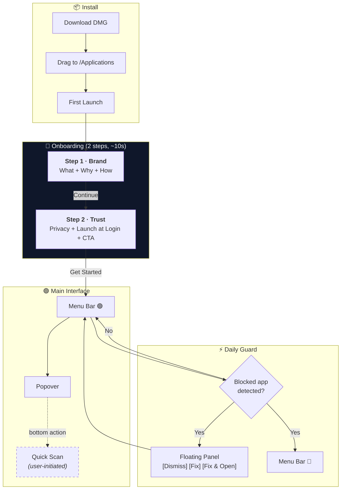

# GreenLight V1.0.0 — Onboarding 重构需求文档

> **产品名称**: GreenLight  
> **版本**: V1.0.0  
> **文档版本**: r01  
> **日期**: 2026-03-02  
> **状态**: 待评审  
> **前置文档**: [MVP PRD](./V1.0.0-r03-MVP需求与技术文档-2026.03.02.md) · [通知系统重构](./V1.0.0-r01-通知系统重构-2026.03.02.md) · [UI 设计规范](./spec/ui_design_spec.md)

---

## 一、Onboarding 目标

| # | 目标 | 验收问题 |
|---|------|----------|
| **G1** | **品牌认知** — 让用户理解 GreenLight 是什么、解决什么问题、怎么工作 | 用户能否一句话复述产品价值？ |
| **G2** | **安全承诺** — 消除信任顾虑：零数据收集、纯本地运行、开源可审计 | 用户是否放心保留 App 长期运行？ |

> [!IMPORTANT]
> 目标之外的一切都不属于 Onboarding。全盘扫描、通知权限、复杂设置等功能入口**全部移至主界面**。

---

## 二、用户旅程全图



---

## 三、Step 1 · Brand（品牌认知）

### 3.1 内容结构

```
┌──────────────────────────────────────────────────────┐
│                                                      │
│              ● ○                                     │
│                                                      │
│         ┌────────┐                                   │
│         │  🔴    │                                   │
│         │  🟡    │   ← Traffic Light                 │
│         │  🟢 ◉  │   ← Green light glows on         │
│         └────────┘                                   │
│                                                      │
│         G r e e n L i g h t                          │
│                                                      │
│    macOS blocks apps downloaded from the internet.   │
│    GreenLight detects and unblocks them — instantly.  │
│                                                      │
│    ┌──────────────────────────────────────────┐      │
│    │  ◎  Detects blocked apps automatically   │      │
│    │  ◎  One-click fix, no Terminal needed     │      │
│    │  ◎  Runs silently, protects continuously  │      │
│    └──────────────────────────────────────────┘      │
│                                                      │
│                  [ Continue ]                        │
│                                                      │
└──────────────────────────────────────────────────────┘
```

### 3.2 文案规格

| 元素 | 英文 | 文案设计理由 |
|------|------|-------------|
| **品牌名** | GreenLight | Inter 700, 22px, letter-spacing 4px |
| **标语** | macOS blocks apps downloaded from the internet. GreenLight detects and unblocks them — instantly. | **先讲问题再讲方案**。14 words per sentence，90%+ comprehension (UX Writing benchmark) |
| **价值点 1** | Detects blocked apps automatically | Benefit-first，not feature-first |
| **价值点 2** | One-click fix, no Terminal needed | 消除最大痛点认知 |
| **价值点 3** | Runs silently, protects continuously | 传达长期价值 |
| **CTA** | Continue | 2-4 words (UX Writing CTA benchmark) |

> [!TIP]
> **文案审核标准**（UX Writing 四标准）：  
> ✅ Purposeful — 每句话服务于"让用户理解产品价值"  
> ✅ Concise — 标语 2 句、每个价值点 ≤ 6 words  
> ✅ Conversational — 无 jargon，plain language  
> ✅ Clear — 具体动词（detects / fix / protects），非模糊词（optimize / streamline）

### 3.3 红绿灯动画

复用 `ui_design_spec.md` §3.1 的拟物红绿灯组件，缩放至 Onboarding 适配尺寸。

**序列动画**（页面首次出现时）：

```swift
// Phase 1 — 红灯闪亮 (象征"被拦截")
t = 0ms
  redBulb.opacity:      0 → 1
  redBulb.glow:         0 → full
  timing:               400ms ease-in

// Phase 2 — 红灯渐灭，绿灯渐亮 (象征"放行")  
t = 600ms
  redBulb.opacity:      1 → 0.15
  greenBulb.opacity:    0 → 1
  greenBulb.glow:       0 → full
  timing:               500ms ease-in-out

// Phase 3 — 绿灯稳定发光
t = 1100ms
  greenBulb:            stable glow (no pulse)
```

**Reduced Motion 降级**：

```swift
@Environment(\.accessibilityReduceMotion) var reduceMotion

if reduceMotion {
    // 跳过动画序列，直接显示绿灯亮起的终态
    redBulb.opacity = 0.15
    greenBulb.opacity = 1
}
```

**灯体尺寸**：

| 属性 | 值 |
|------|-----|
| 整体高度 | 80px（含底座） |
| 灯泡直径 | 18px |
| 外壳宽度 | 32px |
| 渲染 | `radial-gradient` 球面高光 + 金属外壳 gradient |

---

## 四、Step 2 · Trust（安全承诺）

### 4.1 内容结构

```
┌──────────────────────────────────────────────────────┐
│                                                      │
│              ○ ●                                     │
│                                                      │
│         shield.lefthalf.filled                       │  ← SF Symbol
│                                                      │
│         Your privacy is non-negotiable.              │
│                                                      │
│    ┌──────────────────────────────────────────┐      │
│    │                                          │      │
│    │  ◎  Runs entirely offline                │      │
│    │  ◎  No data collection, ever             │      │
│    │  ◎  Only reads system quarantine flags    │      │
│    │  ◎  Open source and auditable            │      │
│    │                                          │      │
│    └──────────────────────────────────────────┘      │
│                                                      │
│    ┌──────────────────────────────────────────┐      │
│    │                                          │      │
│    │  [toggle ON]  Launch at login             │      │
│    │               Stay protected around       │      │
│    │               the clock.                  │      │
│    │                                          │      │
│    └──────────────────────────────────────────┘      │
│                                                      │
│              [ Get Started ]                         │
│                                                      │
└──────────────────────────────────────────────────────┘
```

### 4.2 文案规格

| 元素 | 英文 | 文案设计理由 |
|------|------|-------------|
| **标题** | Your privacy is non-negotiable. | 直接、有力、无含糊。Confident tone (UX Writing) |
| **隐私点 1** | Runs entirely offline | 最强声明放首位 |
| **隐私点 2** | No data collection, ever | "ever" 加强绝对性 |
| **隐私点 3** | Only reads system quarantine flags | 技术边界：只读隔离标记，不碰其他 |
| **隐私点 4** | Open source and auditable | 可验证的信任 |
| **Toggle 标签** | Launch at login | 动作清晰 |
| **Toggle 说明** | Stay protected around the clock. | Benefit-focused，解释"为什么开启" |
| **CTA** | Get Started | [Verb] + [What They Get] pattern (Copywriting skill) |

### 4.3 Shield 图标动画

```swift
// 盾牌入场
t = 0ms
  shield.opacity:   0 → 1
  shield.scale:     0.8 → 1.0
  shield.translateY: 8 → 0
  timing:           spring(response: 0.5, dampingFraction: 0.7)

// 盾牌微光（暗示"保护已激活"）
t = 500ms
  shield.brightness: 0 → 0.15 → 0
  timing:            600ms ease-in-out, once (非持续动画)
```

---

## 五、视觉规格

### 5.1 窗口

| 属性 | 值 | 理由 |
|------|-----|------|
| 尺寸 | 520 × 440 | Dock App 主窗口，留白充足 |
| 背景 | `#0F172A` + `blur(80px) saturate(1.6)` | 复用设计系统 `--bg` |
| 圆角 | macOS 系统默认 | 原生感 |

### 5.2 步骤指示器

| 属性 | 值 |
|------|-----|
| 形式 | 2 个圆点，水平居中 |
| 当前 | 8px, `#22C55E`, `box-shadow: 0 0 8px rgba(34,197,94,0.5)` |
| 非当前 | 6px, `rgba(255,255,255,0.2)` |
| 间距 | 12px |
| 距顶 | 32px |

### 5.3 文字

| 元素 | 字体 | 字号 | 颜色 |
|------|------|------|------|
| 品牌名 | Inter 700 | 22px, letter-spacing 4px | `#F8FAFC` |
| 标语 | Inter 400 | 14px, line-height 1.6 | `rgba(248,250,252,0.6)` |
| 价值点/隐私点 | Inter 500 | 13px | `rgba(248,250,252,0.75)` |
| Toggle 标签 | Inter 600 | 14px | `#F8FAFC` |
| Toggle 说明 | Inter 400 | 12px | `rgba(248,250,252,0.4)` |

### 5.4 卡片容器

| 属性 | 值 |
|------|-----|
| 背景 | `rgba(255,255,255,0.04)` |
| 边框 | `1px solid rgba(255,255,255,0.06)` |
| 圆角 | 14px |
| 内边距 | 20px |

### 5.5 按钮

| 属性 | Primary (Get Started) | Secondary (Continue) |
|------|----------------------|---------------------|
| 背景 | `#22C55E` | `rgba(255,255,255,0.08)` |
| 文字 | White, Inter 600, 15px | `#F8FAFC`, Inter 600, 15px |
| 圆角 | 12px | 12px |
| 内边距 | `12px 32px` | `12px 32px` |
| Hover | `brightness(1.12)`, 200ms | `brightness(1.15)`, 200ms |
| Active | `scale(0.96)`, 120ms | `scale(0.96)`, 120ms |
| Focus | 2px green outline, 3px offset | 同 |

### 5.6 图标

| 元素 | 规格 | 来源 |
|------|------|------|
| 红绿灯 | 80px 高，CSS 拟物渲染 | `ui_design_spec.md` §3.1 |
| 盾牌 | 44px, `shield.lefthalf.filled` | SF Symbols |
| 价值点圆点 | 6px, `#22C55E` | 设计系统 `--green` |
| 隐私点圆点 | 6px, `#22C55E` | 同上 |

> [!IMPORTANT]
> **no-emoji-icons 规则**：所有图标使用 SF Symbols 或 CSS 渲染，禁止 emoji。

---

## 六、页面转场动画

### 6.1 Step 1 → Step 2 转场

```swift
// 当前页退场
content.opacity:     1 → 0
content.translateX:  0 → -24px
timing:              250ms ease-out

// 新页入场
content.opacity:     0 → 1
content.translateX:  24px → 0
timing:              spring(response: 0.35, dampingFraction: 0.85)
```

### 6.2 内容元素交错入场（每页首次出现）

```swift
// 每个元素依次入场，起始延迟 stagger 50ms
element[n].opacity:     0 → 1
element[n].translateY:  6px → 0
element[n].delay:       n * 50ms
timing:                 spring(response: 0.3, dampingFraction: 0.8)

// 元素顺序：
// Step 1:  灯 → 品牌名 → 标语 → 价值卡片 → CTA
// Step 2:  盾牌 → 标题 → 隐私卡片 → Toggle 卡片 → CTA
```

### 6.3 Reduced Motion 降级

```swift
@Environment(\.accessibilityReduceMotion) var reduceMotion

if reduceMotion {
    // 关闭所有 spring/stagger，改为瞬时 opacity fade
    // 红绿灯序列动画直接显示终态
    // 页面转场改为 150ms opacity crossfade
}
```

---

## 七、技术方案

### 7.1 代码变更

| 文件 | 变更 |
|------|------|
| `Views/OnboardingView.swift` | **重写**：2 步流程，自定义分页器 |
| `Views/MainWindowView.swift` | 微调窗口尺寸 520×440 |

### 7.2 不变

| 文件 | 说明 |
|------|------|
| `Detection/FSEventsWatcher.swift` | 扫描从 Onboarding 移出，不需要改造进度回调 |
| `Utilities/Persistence.swift` | 复用 `hasCompletedOnboarding` |
| `GreenLightApp.swift` | 无变更 |

### 7.3 开机自启

```swift
import ServiceManagement

func setLoginItem(enabled: Bool) {
    if enabled {
        try? SMAppService.mainApp.register()
    } else {
        try? SMAppService.mainApp.unregister()
    }
}
```

---

## 八、验收标准

| # | 场景 | 预期结果 |
|---|------|----------|
| OB-1 | 首次启动 | 主窗口显示 Onboarding Step 1 |
| OB-2 | Step 1 红绿灯动画 | 红灯亮→灭、绿灯亮起序列在 ~1.1s 内完成 |
| OB-3 | Step 1 → Step 2 | 点击 Continue，水平滑动转场 |
| OB-4 | Step 2 Toggle | 默认 ON，切换时立即调用 `SMAppService` |
| OB-5 | 点击 Get Started | `hasCompletedOnboarding = true`，进入主界面 |
| OB-6 | 二次启动 | 跳过 Onboarding |
| OB-7 | Reduced Motion | 动画降级为瞬时 opacity fade |
| OB-8 | 步骤指示器 | 2 圆点正确反映当前步骤 |

---

## 九、从 Onboarding 移出的功能归宿

| 功能 | 归宿 | 入口 |
|------|------|------|
| **全盘扫描** | PopoverView 底部按钮 + 空状态引导卡片 | 用户主动触发 |
| **通知权限** | 系统自然触发（可选增强） | 通知系统重构文档 |
| **TCC 文件权限** | FSEventsWatcher 首次访问时系统自动弹窗 | 日常守护流程中自然触发 |

---

## 十、与其他文档的关系

| 文档 | 影响 |
|------|------|
| MVP PRD F10 | 本文档替代 F10 原始定义 |
| 通知系统重构 §3.2 | 本文档覆盖其 Onboarding 简化方案 |
| UI 设计规范 §七 | 待设计清单「Onboarding 首次引导流程」由本文档定义 |
